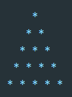
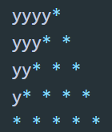

# Program to print full pyramid using *

In this post, we will learn how to print a full pyramid in C++. The program will take the height of the pyramid as input from the user and print it out.
A full pyramid looks as like below:

The height of this pyramid is 5. Our program will print the pyramid of any height.

To print a pyramid, we need to find out how it is printed actually. Let’s take a look at the below pyramid:

This is almost similar to the above one. The only difference is that we are using y and the above pyramid uses blank space.

To learn how to print this triangle, let’s write the algo for the second triangle:

For this triangle, height is 5 and if we consider the row is starting from 0,

For row 0, we are printing 4 y and 1 *.
For row 1, we are printing 3 y and 2 *.
For row 2, we are printing 2 y and 3 *.
So, for row n, we are printing height - n - 1 number of y and n + 1 number of *.

For the first triangle, we need to replace y with blank and add one space after each star.

So, the final algorithm will be:

- Take the height as input from the user
- Run one loop height number of times.
- Use two inner loops to print the blank and *. Print blank for height - i - 1 times and * for i + 1 times, where i is the current row as indicated by the loop.
- Add one blank after each * and don’t add any space between spaces.
- Add one new line after each row.
